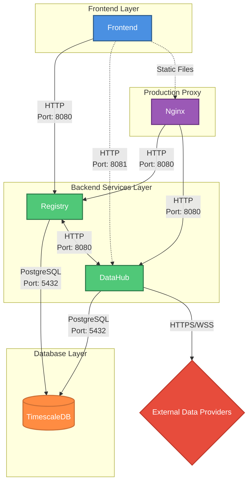

# Quasar Architecture

This document provides a visual representation of the Quasar trading platform architecture, including all services, their ports, connection directions, and protocols.

## Current Architecture Diagram

## Component Descriptions

### Frontend Layer

**Frontend**
- **Purpose**: User interface for managing trading strategies, data providers, and viewing portfolio performance
- **Technologies**: React, Vite
- **Connections**:
  - Development: Direct HTTP to Registry (port 8080) and DataHub (port 8081)
  - Production: Served as static files through Nginx

### Backend Services Layer

**Registry Service**
- **Purpose**: Manages code registry for data providers and brokers, asset management, and asset mappings
- **Technologies**: FastAPI (Python)
- **Key Responsibilities**:
  - Upload and validate custom provider/broker code
  - Manage assets (securities) available from each provider
  - Create and manage asset mappings between providers and brokers
  - Coordinate with DataHub for provider validation and symbol discovery

**DataHub Service**
- **Purpose**: Aggregates data collection from all registered data providers
- **Technologies**: FastAPI (Python)
- **Key Responsibilities**:
  - Load and execute registered data provider code
  - Schedule and execute data collection jobs based on subscriptions
  - Fetch historical and live market data from external providers
  - Store collected data in TimescaleDB
  - Validate provider code on behalf of Registry

### Database Layer

**TimescaleDB**
- **Purpose**: Time-series database storing all market data and system metadata
- **Technologies**: PostgreSQL with TimescaleDB extension
- **Key Tables**:
  - `historical_data`: OHLCV bars for historical data providers
  - `live_data`: OHLCV bars for live/realtime data providers
  - `code_registry`: Registered provider and broker code
  - `assets`: Available securities from each provider
  - `asset_mapping`: Mappings between common symbols and provider-specific symbols
  - `provider_subscription`: Active data collection subscriptions

### Production Proxy

**Nginx**
- **Purpose**: Reverse proxy and static file server for production deployments
- **Technologies**: Nginx
- **Routing**:
  - `/api/registry/*` → Registry service (port 8080)
  - `/api/datahub/*` → DataHub service (port 8080)
  - `/` → Static frontend files

### External Data Providers

**External Data Providers**
- **Purpose**: Third-party services providing market data (historical and real-time)
- **Examples**:
  - **EODHD**: Historical OHLCV data for stocks, ETFs, forex, and crypto via HTTPS REST API
  - **Kraken**: Real-time cryptocurrency market data via WSS (WebSocket) and HTTPS REST API

## Connection Details

### Internal Docker Network Connections

All services run in Docker containers and communicate via Docker's internal network:

- **Registry ↔ DataHub**: Bidirectional HTTP communication on port 8080 (internal Docker hostname `datahub:8080`)
- **Registry → Database**: PostgreSQL connection on port 5432
- **DataHub → Database**: PostgreSQL connection on port 5432

### External Connections

- **Frontend → Backend**: 
  - Development: Direct HTTP to Registry (port 8080) and DataHub (port 8081)
  - Production: Through Nginx reverse proxy (port 80/443)
- **DataHub → External Providers**: HTTPS/WSS connections over the internet

### Connection Protocols

- **PostgreSQL**: Database protocol on port 5432
- **HTTP**: REST API communication between services and frontend
- **HTTPS**: Secure HTTP for external API calls
- **WSS**: Secure WebSocket for real-time data streams

## Development vs Production

### Development Mode
- Frontend runs on Vite dev server (port 3000)
- Services run via Docker Compose
- Frontend proxies API requests directly to backend services
- CORS enabled for `localhost:3000`

### Production Mode
- Frontend built as static files
- Nginx serves static files and proxies API requests
- All external access goes through Nginx (port 80/443)
- Services communicate via internal Docker network

## Legend

- **Blue (Frontend)**: User-facing web application
- **Green (Backend)**: Internal microservices
- **Orange (Database)**: Data persistence layer
- **Red (External)**: Third-party services
- **Purple (Proxy)**: Production reverse proxy
- **Solid arrows**: Direct connections (unidirectional)
- **Double arrows (↔)**: Bidirectional connections
- **Dashed arrows**: Optional/conditional connections (e.g., production routing)

## Future Architecture Additions

This diagram represents the current state of Quasar. Future planned components can be added to this diagram as they are developed, maintaining the same color and shape conventions.

